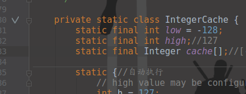
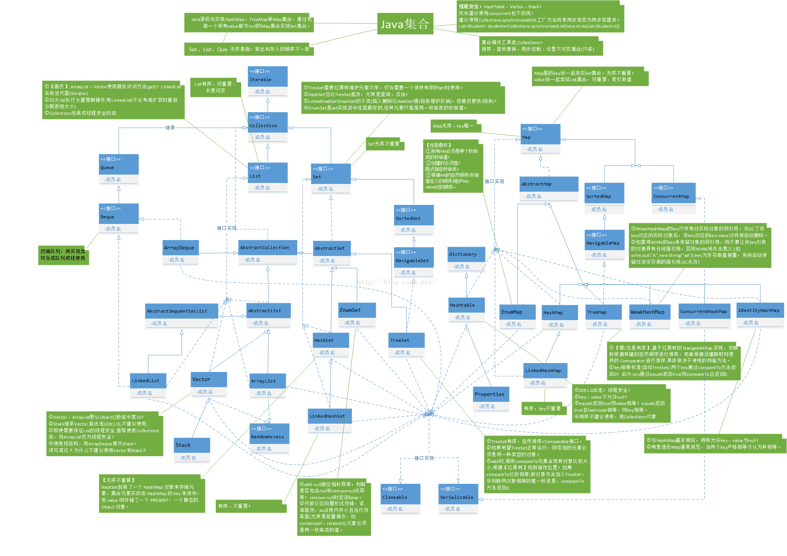
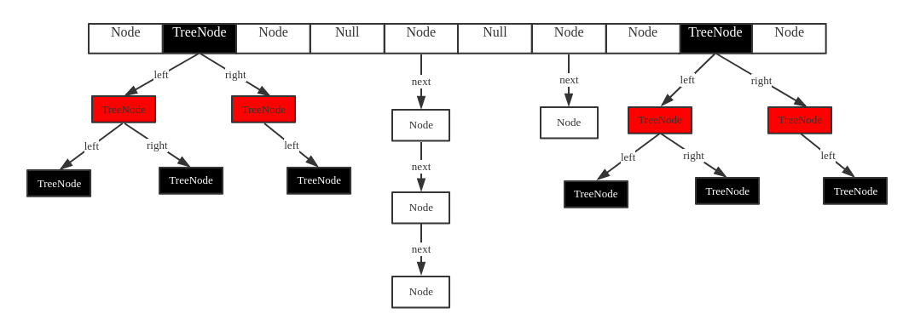
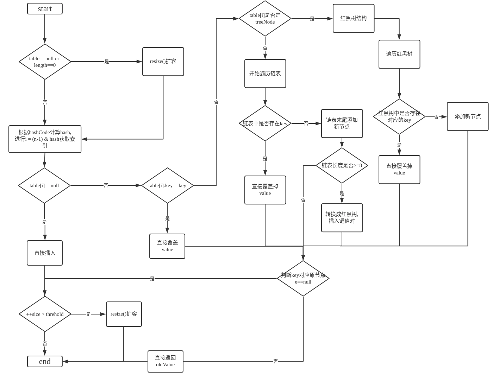
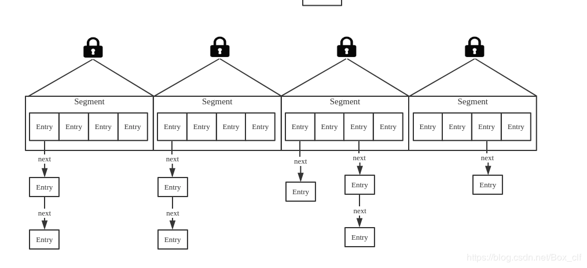
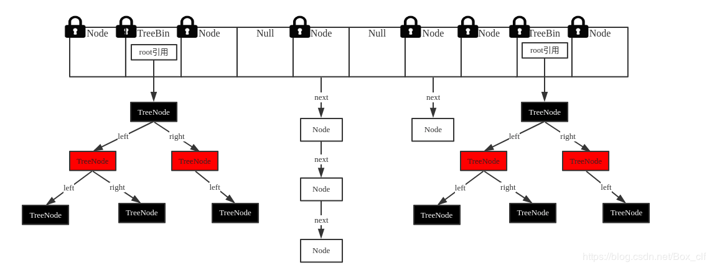
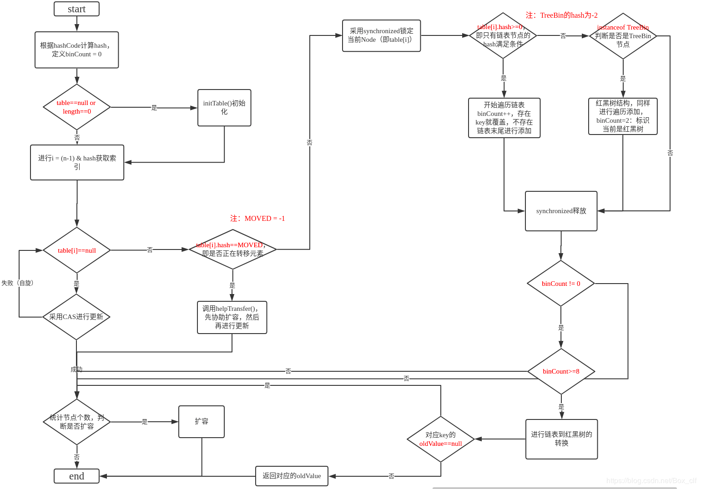
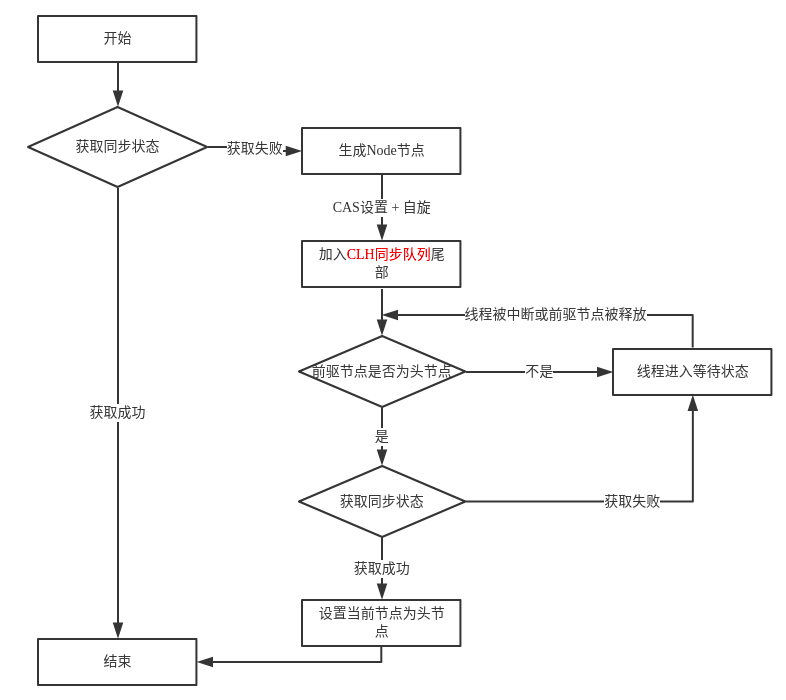
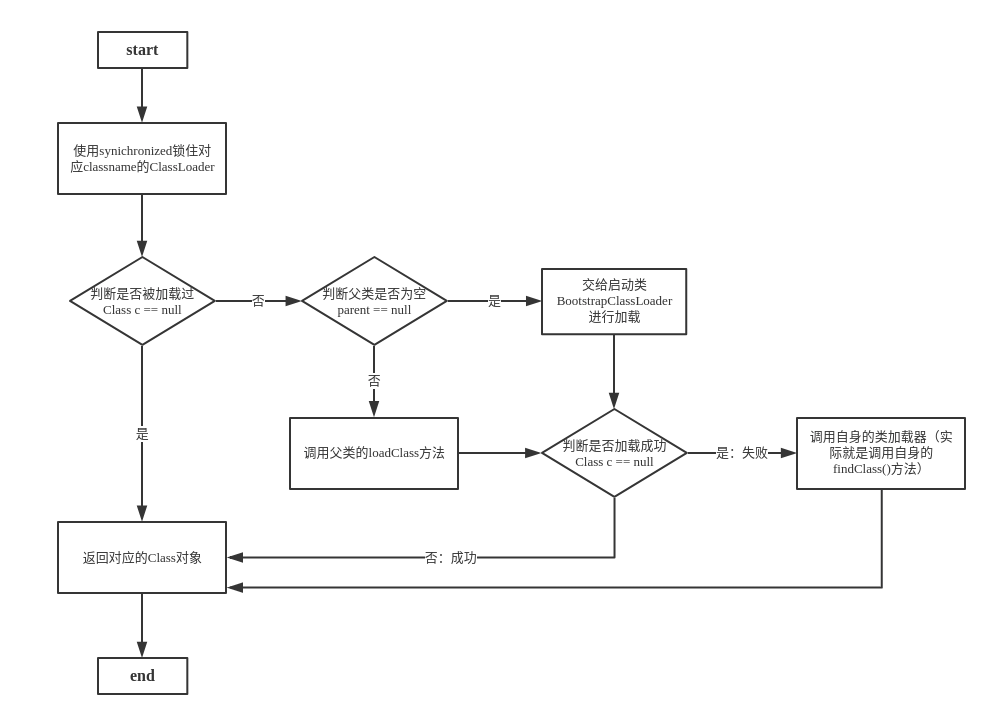

# JDK-Source
jdk源码学习
## 目录
* [如何进行源码的阅读?](#如何进行源码的阅读?)
    * [对于源码阅读顺序](#对于源码阅读顺序)
    * [阅读源码的方法](#阅读源码的方法)
* [String](#String)
    * [常考面试题](#常考面试题)
* [整型缓存](#整型缓存)
* [重载](#重载)
* [集合完整图谱](#集合完整图谱)
* [ArrayList](#arraylist(非线程安全))
* [Vector](#vector(线程安全))
* [LinkedList](#linkedlist(非线程安全))
* [HashMap_jdk1.8](#hashmap_jdk1.8(非线程安全))
    * [put和get方法分析](#putget)
    * [HashMap引出的求余%和与运算&转换问题](#HashMap引出的求余%和与运算&转换问题)
    * [HahMap中线程不安全问题](#hashmap中线程不安全问题)
* [TreeMap](#treemap(非线程安全))
* [Hashtable](#hashtable(线程安全))
* [LinkedHashMap](#linkedhashmap(非线程安全))
* [HashSet](#hashset(非线程安全))
* [ConcurrentHashMap](#concurrenthashmap(线程安全))
    * [1.7版本](#1.7版本)
    * [1.8版本](#1.8版本)
    * [1.8核心源码解析](#1.8核心源码解析)
* [ThreadLocal](#threadlocal)
    * [主要方法](#主要方法)
    * [关于为什么ThreadLocal中的Entry申明为弱引用?](#关于为什么ThreadLocal中的Entry申明为弱引用?)
    * [相关问题](#相关问题)
* [AQS简析](#aqs简析)
    * [主要流程](#主要流程)
* [synchronized 和 ReentrantLock](#synchronized-和-reentrantlock)
    * [synchronized原理浅析md文档](../Test/src/main/java/Synchronized/synchronized.md)
    * [ReentrantLock](#reentrantlock)
    * [synchronized和ReentrantLock异同](#synchronized和reentrantlock异同)
* [类加载源码分析](#类加载源码分析)
    * [核心源码解读](#核心源码解读)
    * [类加载流程图](#类加载流程图)
    * [类加载总结](#类加载总结)
* [IO流](#IO流)
* [序列化](#序列化)
* [反射学习.md](../Test/src/main/java/Reflection/总结反射.md)

## 如何进行源码的阅读?
### 对于源码阅读顺序
* 建议先从常用类进行入手进行解读,初次尝试源码阅读可以结合别人的博客进行阅读
    * 具体可以先从**方法**和**成员变量**的作用进行理解和解读
    * 然后进行方法内部的具体实现进行解读
    * 最后结合子类和继承的父类或接口进行解读
* [后续源码阅读顺序参考博客](https://blog.csdn.net/qq_21033663/article/details/79571506)
### 阅读源码的方法
这里分享一下自己阅读的经验,我使用的是intellij
* 学会使用bookmarks,用于标记阅读源码的位置便于下一次继续进行阅读
    * bookmarks标记: ctrl + 单击鼠标左键
    
    
    * 查看标记内容: Shift + F11
    
    
    * [参考博客](https://blog.csdn.net/qq_36376059/article/details/80277767)
* **学会进行写注释**,可以结合博客和自己的理解然后进行分析写注释
## String
* String使用char[]保存字符串的值,而且还是静态常量
* 当相同的字符串被多次创建(使用双引号显式声明)时,**字符串常量对象会被创建在常量池中**,且只会有一个对象
* intern(): 去常量池中寻找当前的字符串常量
    * 如果有则直接返回常量池中的对象
    * 如果没有会将当前的字符串引用(jdk1.7之后)放入常量池(如果是jdk1.7之前会直接复制到常量池),然后返回
* 字符串对象的+号运算,会在堆内存中生成新的字符串对象
### 常考面试题
* question1:[结合代码理解](../JVM-Learning/src/com/ConstantPoolTest.java)
    * String s1 = "abc"; 
      String s2 = "abc";
      String s3 = new String("abc");
       问有几个实例对象?
    >答: 两个对象,堆中一个"abc",常量池一个"abc"
    * [参考博客](https://blog.csdn.net/Mypromise_TFS/article/details/81504137)
* question2:[这段代码运行结果是什么](../Test/src/main/java/String/StringTest.java)
    * 分析: 
## 整型缓存
* 包括:
    * Integer(-128 --- +127)
    * Long(-128 --- +127)
    * Short(-128 --- +127)
    * Byte(-128 -- +127)
    * Character(0 -- +127): 表示标准的128个ASCII字符
* 缓存机制,结合源码查看
    * 缓存内容: 存在一个cache[]数组中
    * 类加载时通过静态代码块进行初始化
* [运行示例分析](../Test/src/main/java/IntegerTest/IntegerDemo.java)

## 重载
* 方法名相同,参数不同
* java选择调用哪个重载方法,是在编译时期决定的
    * 运行时类型虽然不同,但是编译时类型是相同的,所以选用了同一个重载
* 对重载方法的选择是**静态的**,对覆盖方法的选择是动态的
* 覆盖: 在子类中重写父类的方法
    * java对调用那个覆盖方法,是运行时决定的,依据是对象的运行时类型
    * 如果子类覆盖了覆盖的方法,调用子类实例的方法,
    那么调用的就是子类中重写的方法,因为运行时类型一定是子类的类型,
    引用子类的那个类型可以是父类类型
## 集合完整图谱

    
## ArrayList(非线程安全)
* 实现了 RandomAccess 接口,标识着这个类可以快速随机访问
* 构造函数
    * 无参: 底层默认创建一个空数组,在进行第一次添加操作时进行扩容为默认的**容量10**
    * 传入int n: 创建一个容h量为n的数组
    * 传入集合: 使用Arrays.copyOf()进行遍历赋值到当前ArrayList中
* 底层数组设定的最大长度为**MAX_ARRAY_SIZE = Integer.MAX_VALUE - 8**
* 扩容条件: **插入元素时,当需要元素空间大于数组现有容量时进行扩容**
* 只有在minCapacity > MAX_ARRAY_SIZE时会扩容到Integer.MAX_VALUE
* 核心扩容方法 grow(int minCapacity):
    * 传入minCapacity,最小所需容量的空间
    * 实现: `newCapacity = oldCapacity + (oldCapacity >> 1);`
    * 使用的移位操作,**扩容为之前的1.5倍容量**
* copyOf()和arraycopy()
    * toString方法底层使用Arrays.copyOf()
    * add()或remove()使用的是System.arraycopy()
    * 实质:copyOf()底层还是由arraycopy()实现
    * [copyOf()使用示例](../Test/src/main/java/ArraycopyAndCopyOf/ArrayscopyOfTest.java)
    * [arraycopy()使用示例](../Test/src/main/java/ArraycopyAndCopyOf/ArrayscopyOfTest.java)
## Vector(线程安全)
* 除了构造发方法以外的**所有方法都是synchronized同步的**
* 区别于ArrayList： ArrayList不是同步的,所以**在不需要保证线程安全时时建议使用ArrayList**

## LinkedList(非线程安全)
* 初始大小为0
* 实现了 List接口,Deque接口的双端链表

## HashMap_jdk1.8(非线程安全)



* 默认初始table使用的是Map.Entry<K,V>[]实现**链表结构**进行存储
* 转换临界值:TREEIFY_THRESHOLD = 8;**链表长度 >= 8时进行转换**,转换成**红黑树**结构
* table**默认初始容量为16**;DEFAULT_INITIAL_CAPACITY = 1 << 4
* table**最大容量为2的30次方**;MAXIMUM_CAPACITY = 1 << 30
* table默认的负载因子DEFAULT_LOAD_FACTOR = 0.75,**只有元素总量达到总容量的75%才会进行扩容**
* 扩容**每次扩容为原有容量的2倍,保证了容量n为2的x次方**
### put和get方法
* put(key,value)方法:
    * 如果定位到的数组位置没有元素 就直接插入.
    * 如果定位到的数组位置有元素就和要插入的key比较
    * 如果key相同就直接覆盖
    * 如果key不相同,就判断p是否是一个树节点
    * 如果是就调用e = ((TreeNode<K,V>)p).putTreeVal(this, tab, hash, key, value)将元素添加进入
    * 如果不是就遍历链表插入。
* get(key)方法:
    * **根据key的hashCode计算对应的hash**(int类型)
    * **然后通过(n - 1) & hash 得到元素存放的位置**
    * 调用getNode(hash,key):
        * 先根据hash的模运算得到索引再比较key
        * 满足(k = e.key) == key || (key != null && key.equals(k)),即当前节点key内存地址相等且key对象内容相等
        * 返回对应节点
    * 返回节点的value
### HashMap引出的求余%和与运算&转换问题
* 当n = 2的x次幂时,满足转换条件,**(n - 1) & hash 等价于 hash % n**
* [参考博客](https://www.cnblogs.com/ysocean/p/9054804.html)

### HashMap中线程不安全问题
* 扩容导致的链表死循环问题:
    * 注:**这个问题只存在1.7中,1.8已经不存在死循环问题**,因为在jdk1.7中使用的**头插法**,而jdk1.8使用的是**尾插法**
* 数据覆盖问题:即多个线程添加元素时的 ++size 操作,不是原子操作,可能会出现多次添加操作后size只加了一次
* put流程:



* 多线程操作时主要存在线程安全的方法是: resize()
>resize主要工作: 当扩容时需要遍历将oldTab中的所有node节点,并计算出新的索引位置后,转移到newTable
* [为什么HashMap1.7存在死循环问题?](https://blog.csdn.net/bjwfm2011/article/details/81076736)

## TreeMap(非线程安全)
* 底层使用的**红黑树**,时间复杂度是O(logN)
* key不能为null,为null时会抛出NullPointException
* 想要自定义比较器,可以在构造方法中传入指定的Comparator对象,否则使用key默认的比较器来进行比较
* TreeMap非同步的,想要同步可以使用Collections来进行封装
* [具体源码分析](src/java/util/TreeMap.java)

## Hashtable(线程安全)
* 线程安全,大多数方法采用了synchronized进行同步处理
* 设置默认的**初始容量为11,负载因子为0.75**


## LinkedHashMap(非线程安全)
* **继承HashMap**,即内部实际调用的还是HashMap的方法进行添加或删除
* 底层是**双向链表**来维护节点顺序
* 每次插入数据时会增加节点,访问或修改数据时会调整链表的节点顺序,从而决定迭代时输出的顺序
    * accessOrder若为**false**(默认情况下为false),遍历双向链表时,是按照**插入顺序排序的**
    * accessOrder若为**true**(需要通过下面的构造方法进行设置),表示双向链表中的元素按照**访问的先后顺序排序**,最先遍历(链表头)的是**最近最少使用的元素**
```java_holder_method_tree
    public LinkedHashMap(int initialCapacity,
                         float loadFactor,
                         boolean accessOrder) {
        super(initialCapacity, loadFactor);
        this.accessOrder = accessOrder;
    }
```

## HashSet(非线程安全)
* 底层使用的是HashMap

## ConcurrentHashMap(线程安全)
### 1.7版本
* 主要使用的是Segment分段锁
* 内部拥有一个Entry数组，每个数组的每个元素又有一个链表
* 同时Segment继承ReentrantLock来进行加锁
* **默认Segment有16个**，也就是说可以**支持16个线程的并发**，在初始化是可以进行设置，一旦初始化就无法修改（**Segment不可扩容**），但是Segment内部的**Entry数组是可扩容的**。
* 1.7时结构: 



### 1.8版本
* **摒弃了分段锁的概念，启用 node + CAS + Synchronized 代替Segment**
* 当前的 table[ (n - 1) & hash ] == null 时，采用**CAS操作**
* 当产生hash冲突时，采用**synchronized关键字**
* 内部结构和HashMap相同，仍然使用： **数组 + 链表 + 红黑树**
* **默认sizeCtl = 16，初始化时可以进行设置**
* 1.8时结构: 


### 1.8核心源码解析
* put方法：
```
public V put(K key, V value) {
    return putVal(key, value, false);
}

final V putVal(K key, V value, boolean onlyIfAbsent) {
    if (key == null || value == null) throw new NullPointerException();
    int hash = spread(key.hashCode());
    int binCount = 0;
    //使用自旋的方式对插入元素进行重试
    for (Node<K,V>[] tab = table;;) {
        Node<K,V> f; int n, i, fh;
        //插入元素时进行判断table是否为null
        if (tab == null || (n = tab.length) == 0)
            //如果为null，未被初始化过，则进行初始化操作，默认初始大小为16
            tab = initTable();
        else if ((f = tabAt(tab, i = (n - 1) & hash)) == null) {//若当前索引坐标元素为null，则直接进行cas添加
            if (casTabAt(tab, i, null,//cas无锁化提高效率,同时保证线程安全
                         new Node<K,V>(hash, key, value, null)))
                break;                   // no lock when adding to empty bin
        }
        else if ((fh = f.hash) == MOVED)//当前Map在扩容，先协助扩容，再更新值
            tab = helpTransfer(tab, f);
        else {// hash冲突
            V oldVal = null;
            synchronized (f) {//以对应索引元素f节点作为锁
                if (tabAt(tab, i) == f) {//双重判断，是否为原头节点，是否当前期间进行了改变
                    if (fh >= 0) {//判断当前节点hash >= 0,大于0说明是链表结构，因为红黑树的TreeBin节点的hash为-2
                        binCount = 1;
                        for (Node<K,V> e = f;; ++binCount) {//遍历
                            K ek;
                            if (e.hash == hash && ((ek = e.key) == key // 节点已经存在，修改链表节点的值
                                    || (ek != null && key.equals(ek)))) {
                                oldVal = e.val;
                                if (!onlyIfAbsent)
                                    e.val = value;
                                break;
                            }
                            Node<K,V> pred = e;
                            if ((e = e.next) == null) {     // 节点不存在，加到链表末尾
                                pred.next = new Node<K,V>(hash, key,
                                                          value, null);
                                break;
                            }
                        }
                    }
                    else if (f instanceof TreeBin) {//是否是红黑树结构
                        Node<K,V> p;
                        binCount = 2;//标识当前是红黑树
                        if ((p = ((TreeBin<K,V>)f).putTreeVal(hash, key,
                                                       value)) != null) {
                            oldVal = p.val;
                            if (!onlyIfAbsent)
                                p.val = value;
                        }
                    }
                }
            }
            if (binCount != 0) {//binCount即不等于0,表示进行了遍历添加操作
                if (binCount >= TREEIFY_THRESHOLD)//如果大于8,则保证了是链表遍历添加操作
                    treeifyBin(tab, i);//进行链表 ---> 红黑树的转换
                if (oldVal != null)
                    return oldVal;
                break;
            }
        }
    }
    addCount(1L, binCount);// 统计节点个数，检查是否需要resize
    return null;
}
```
* 流程图：



## ThreadLocal
* 一般叫做线程本地变量
* 实际使用ThreadLocalMap进行保存
* 初始的ThreadLocalMap中的table容量为16
* table扩容临界值为当前容量的2/3,只有满足当前条件才会进行扩容
* 每次扩容为原有容量的2倍

### 主要方法 
* public T get()
    * 获取当前线程
    * 得到对应的ThreadLocalMap
    * 然后接着下面获取到<key,value>键值对,**传入this**,不是线程t
    * 如果存在键值对,返回value
    * 不存在ThreadLocalMap 或 不存在对应的键值对 则调用setInitialValue()
        * 如果是ThreadLocalMap不为空,直接添加键值对
        * ThreadLocalMap为空,创建map并添加
        * 方法最后返回对应的初始值initialValue()中的value    
* public void set()
    * 获取当前线程t
    * 调用getMap(t)获取ThreadLocalMap
    * 不为空直接添加
    * 为空创建map并添加
* public void remove()
    * 获取当前线程
    * 获取当前线程的ThreadLocalMap
    * 存在则**传入this**,进行移除对应的键值对
* protected T initialValue()
    * 默认初始的ThreadLocal返回的value为null,一般会对该方法进行重写
* [ThreadLocalDemo示例](../Test/src/main/java/Thread/ThreadLocal/ThreadLocalDemo.java)
### 关于为什么ThreadLocal中的Entry申明为弱引用?
[参考博客](https://www.cnblogs.com/waterystone/p/6612202.html)
### 相关问题
* 为什使用弱引用?
> 当ThreadLocal = null后,还存存在Thread中的ThreadLocalMap中的Entry对添加的obj的引用,
如果Entry不使用弱引用将只有等到整个线程运行完后才能进行GC回收,
而这里的Entry所存储的obj我们已经不能从ThreadLocalMap中取出使用,
所以这里的Entry已经可以进行回收,只有使用弱引用才能被垃圾回收器回收.

## AQS简析
[参考博客](http://www.cnblogs.com/waterystone/p/4920797.html)
### 主要流程
* 调用自定义同步器的tryAcquire()尝试直接去获取资源，如果成功则直接返回；
* 没成功，则addWaiter()将该线程加入等待队列的尾部，并标记为独占模式；
* acquireQueued()使线程在等待队列中休息，有机会时（轮到自己，会被unpark()）会去尝试获取资源。获取到资源后才返回。如果在整个等待过程中被中断过，则返回true，否则返回false。
* 如果线程在等待过程中被中断过，它是不响应的。只是获取资源后才再进行自我中断selfInterrupt()，将中断补上。



## synchronized 和 ReentrantLock
### ReentrantLock
* 继承接口Lock
* 成员变量 Sync sync
* 内部抽象类Sync继承AbstractQueuedSynchronizer
* 存在两个实现类NonfairSync和FairSync继承Sync
* lock()方法:
    * 通过回调内部的Sync的lock实现方法,即NonfairSync或FairSync的lock
        * 公平锁(Fair):
        >加锁前检查是否有排队等待的线程，优先排队等待的线程，先来先得 
        * 非公平锁(Nonfair):
        > 加锁时不考虑排队等待问题，直接尝试获取锁，获取不到自动到队尾等待
    * 默认使用的是非公平锁(Nonfair):
    > 在获取时先cas改变一下 AQS 的state值, 改变成功就获取, 不然就加入到  AQS 的 Sync Queue 里面
    
### synchronized和ReentrantLock异同
* 相同:
    * 都实现了多线程同步和内存可见性语义
    * 都是可重入锁
* 不同点:
    * 实现机制不同:
        * synchronized通过java对象头锁标记和Monitor对象实现 
        * ReentrantLock通过CAS、AQS（AbstractQueuedSynchronizer）和locksupport（用于阻塞和解除阻塞）实现 
        * synchronized依赖jvm内存模型保证包含共享变量的多线程内存可见性 
        * ReentrantLock通过ASQ的volatile state保证包含共享变量的多线程内存可见性
    * 使用方式不同:
        * synchronized可以修饰实例方法（锁住实例对象）、静态方法（锁住类对象）、代码块（显示指定锁对象）
        * ReentrantLock显示调用trylock()/lock()方法，需要在finally块中释放锁
    * 功能丰富程度不同:
        * ReentrantLock提供有限时间等候锁（设置过期时间）、可中断锁（lockInterruptibly）、condition（提供await、signal等方法）等丰富语义 
        * ReentrantLock提供公平锁和非公平锁实现
        * synchronized不可设置等待时间、不可被中断（interrupted）
## 类加载源码分析
### 核心源码解读
```
protected Class<?> loadClass(String name, boolean resolve)
        throws ClassNotFoundException//
    {
        synchronized (getClassLoadingLock(name)) {
            // First, check if the class has already been loaded
            Class<?> c = findLoadedClass(name);//判断该类是否被加载过
            if (c == null) {//没有被加载才进行加载
                long t0 = System.nanoTime();
                try {
                    if (parent != null) {//父类不为空时
                        //将加载任务交给父类进行加载
                        c = parent.loadClass(name, false);
                    } else {
                        //如果父类为null交给启动类进行加载
                        c = findBootstrapClassOrNull(name);
                    }
                } catch (ClassNotFoundException e) {
                    // ClassNotFoundException thrown if class not found
                    // from the non-null parent class loader
                }

                //判断父类是否加载成功
                if (c == null) {
                    // If still not found, then invoke findClass in order
                    // to find the class.
                    /**
                     * 父类加载后仍然是null,则没有加载成功,则在当前方法进行具体的加载过程
                     */
                    long t1 = System.nanoTime();
                    c = findClass(name);

                    // this is the defining class loader; record the stats
                    sun.misc.PerfCounter.getParentDelegationTime().addTime(t1 - t0);
                    sun.misc.PerfCounter.getFindClassTime().addElapsedTimeFrom(t1);
                    sun.misc.PerfCounter.getFindClasses().increment();
                }
            }
            if (resolve) {
                resolveClass(c);
            }
            return c;
        }
    }
```
### 类加载流程图

### 类加载总结
>类加载时首先会去判断是否存在父类，如果父类存在则交给父类进行加载，依次向上找顶层；
如果父类无法加载就或加载异常，就向下交给子类进行加载。

## IO流
* 字节流
* 字符流:用来操作字符的
* Input流:读数据
* Output流:写数据
* 输入输出是相对于本机内存的
* java代码中的汉字是使用的Unicode进行编码实现的(Unicode兼容了ASCII)
* char类型长度是两个字节,能够表示中文,因为Unicode字符集中中文对应的数字,用两个字节就足够表示了
* utf-8编码,使用的就是unicode字符集
    * utf-8是用一个运算规则,把unicode字符集的数字转换成计算机能识别的编码
    * utf-8标识的汉字,占用3个字节 
    * 汉字转换成utf-8之后格式: 1110 XXXX | 10XX XXXX | 10XX XXXX
    * **了解utf-8是如何将unicode字符集进行转换的**
## 序列化
* 序列化将对象的状态信息装换成可以存储或传输的形式的**过程**
* 计算机中保存的所有数据都是二进制数据
* 总结: 序列化就是把计算机中的各种各样的格式(文本,图片,音频,视频)变成数字的过程
* 变成数字后,用IO流读写
    * 字节流
* 反序列化: 就是把二进制数据还原成各种各样的数据格式的过程
* [测试demo](../Test/src/main/java/SerializationTest)
